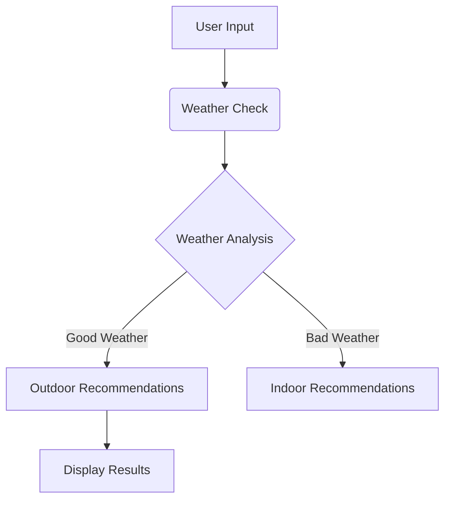

# 🍽️ Julep-Enabled Weather-Based Dining Advisor

This intelligent agent provides smart, personalized dining recommendations based on current **weather conditions** and **time of day**, powered by **Julep AI** and **OpenWeatherMap**.

---

## 🎯 Objective

Leverage the Julep AI orchestration framework and LLM capabilities to:

- Query real-time weather data using OpenWeatherMap
- Analyze input context (city + time of day)
- Prompt GPT-4o to generate curated dish suggestions
- Output results to user with helpful tips

---

## 🧰 Technologies & APIs Used

| Technology       | Purpose                                  |
|------------------|-------------------------------------------|
| **Julep AI SDK** | Agent/task orchestration and LLM access   |
| **OpenWeatherMap API** | Real-time weather data              |
| **Python**       | Application scripting and execution logic |
| **GPT-4o**       | Natural language reasoning & response     |

---

## 🧠 How It Works

## 🧰 Architecture Diagram



---

## 🔍 Step-by-Step Process

### 1. 🛠️ Install Julep SDK
```bash
pip install julep -U --quiet
```

### 2. 🔑 Set Up Client
- Provide a valid Julep API Key.
- Use `production` environment for deployment.

### 3. 🧠 Create AI Agent
- Uses **GPT-4o**
- Role: Culinary expert
- Objective: Recommend dishes based on weather & time context

### 4. 📋 Define AI Task
- Receives inputs: `city` and `time_of_day`
- Fetches weather data using OpenWeatherMap integration
- Prompts GPT with structured info for contextual suggestions

### 5. 🚦 Run the Execution
- Inputs collected via command line
- LLM returns:
  - Dish suggestions
  - Preparation tips
  - Dining environment advice

---

## 💻 Sample Interaction

**Input**
```text
City: Tokyo
Time of Day: evening
```

**Output**
```text
🌧️ Weather: Rainy, 290K

🍜 Recommended Dishes:
- Hot Ramen
- Grilled Yakitori
- Warm Miso Soup

💡 Tips:
- Dine indoors to stay cozy.
- Serve dishes with hot green tea or sake.
```

---

## 🚀 How to Run

```bash
python dining_julep_executor.py
```

Ensure the script or `.env` file contains:
- Your **Julep API Key**
- Your **OpenWeatherMap API Key**

---

## 🔐 Security Best Practices

- **Never** commit API keys to version control
- Use `.env` file or environment variables for secret keys
- Rotate keys regularly

---

## 🌟 Future Roadmap

- UI via Streamlit or Gradio
- Live Google Maps integration for restaurant links
- Historical weather-based recommendation patterns
- Voice input/output support

---

## 📜 License

Distributed under the **MIT License** — see the LICENSE file for details.

---

## 👤 Author

**Subham Agarwal**  
Crafted as part of the **Julep AI Founder's Office** application.  
Passionate about culinary intelligence & LLM applications.

---

## 🙌 Acknowledgements

- [Julep AI](https://julep.ai/)
- [OpenWeatherMap](https://openweathermap.org/)
